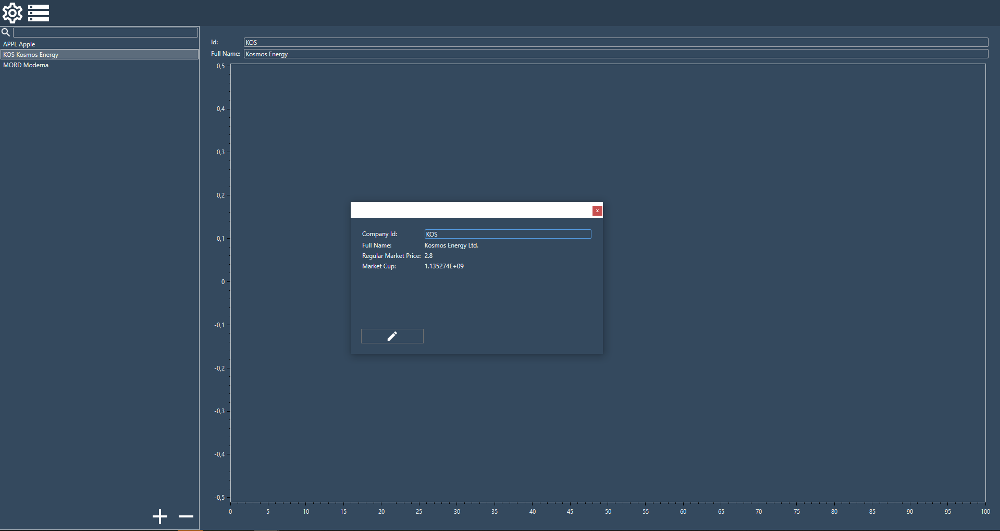

# StockDataViewer
 Wpf/Mvvm Aplication that uses yahoo and basic algorithms to track stock data.
 
 Tools used in the project:
 - Ninject
 - SqLite
 - YahooFinancialApi
 - Quartz
 
 ToDo:
 https://trello.com/b/3j90SMqM/stockdataviewer
 
 
